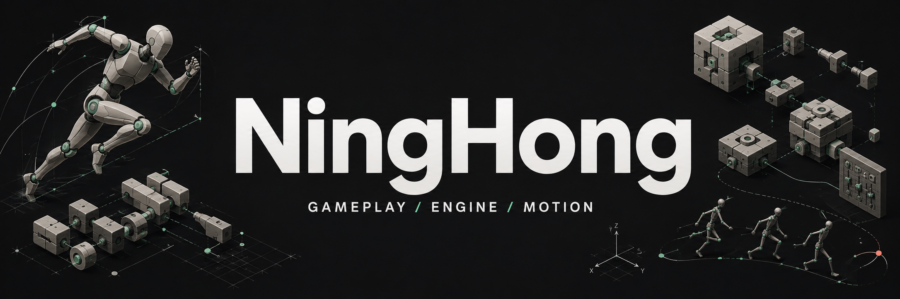

  

  <strong>我是宁鸿，围绕 Unreal Engine / C++ 学习和实践。</strong> 
  从 Gameplay 到引擎源码，从角色动画到脚本工具链， 
  希望把具体功能做出来，也逐步理解它背后的运行机制。

  <a href="#zerog">ZeroG</a> &nbsp; · &nbsp;
  <a href="#ue-object-pool">UE 对象池</a> &nbsp; · &nbsp;
  <a href="#aianimationsystem">AIAnimationSystem</a> 
  <a href="#verseangelscript--vas">VAS</a> &nbsp; · &nbsp;
  <a href="#hybrid-motion-imitation">Hybrid-Motion-Imitation</a> &nbsp; · &nbsp;
  <a href="https://github.com/Aceared0829?tab=repositories">全部仓库</a>

> **项目状态**：ZeroG 和 UE 对象池仍在开发；AIAnimationSystem 与 VAS 处于早期探索；Hybrid-Motion-Imitation 目前仅 Fork。这里既展示已经落地的工作，也保留尚未完成的部分。

## ZeroG

 &nbsp; GAMEPLAY / GAS / TRAVERSAL

**基于 UE 5.8 的 C++ 动作游戏技术验证项目。** 围绕战斗、武器、连招和角色运动，实践游戏逻辑、动画与引擎机制之间的协作。

**已有实践**

- **GAS 战斗结构**：由 PlayerState 持有 ASC 与属性集，结合 GameplayAbility、GameplayEffect 和 Gameplay Tags 组织技能与角色状态。
- **武器与连招**：通过组件和动作数据管理武器切换、连招与 Montage；处理武器攻击贡献的重复更新和 Avatar 交接清理。
- **命中检测**：采样当前骨骼姿态的世界空间插槽，结合帧间运动路径补偿，提供 Line、Box、Sphere、Capsule 等检测方式。
- **角色运动与 Traversal**：在 MotionMatchingInCpp 插件中组织运动状态、障碍与边缘检测、Chooser 动作选择、Motion Warping 和 Montage 播放辅助。

**当前阶段**：源码和可编辑工程资源已经公开，但它仍是原型。地图、资产引用、动画表现、多人玩法和完整 Cook / 游戏包启动仍需继续完善或验证。

<strong>展开：模块关系、回归验证与后续工作</strong>

#### 模块与数据

- ZeroG 游戏模块负责玩家、Boss、GAS 战斗、武器、连招和命中处理。
- MotionMatchingInCpp 插件提供通用角色运动与 Traversal 能力，通过接口与游戏侧协作，不反向依赖 ZeroG 模块。
- 动画蓝图、PoseSearch 数据库、Chooser 表、Montage 与关卡配置仍由工程资源承载；插件名称不代表整个动画图已经由 C++ 实现。

#### 已记录的验证

2026-09-07 / 08 的公开预览版本记录了 UE 5.8.2 下的 Editor / Game 编译，以及四项 UE 回归：

- 命中检测的世界空间采样与帧间路径。
- 武器攻击贡献的幂等更新及清理。
- 武学状态重置的有效与无效 Avatar 路径。
- Chooser 选定动作之后的 Traversal 禁用标签检查。

四项回归均通过，其中两项带警告；资源恢复脚本也有独立的完整性与冲突保护测试。这些是指定版本的验证记录，不等于完整地图、联网或游戏打包已经通过。

#### 后续重点

修正残留资产与默认地图引用，梳理 Blueprint / C++ Traversal 调用路径，补充真实场景、动画效果、多人 PIE 与 Cook 验证。Release 提供可编辑资源，不是玩家双击运行的安装包。

[源码](https://github.com/Aceared0829/ZeroG) · [架构说明](https://github.com/Aceared0829/ZeroG/blob/codex/open-source/Docs/ARCHITECTURE.md) · [验证记录](https://github.com/Aceared0829/ZeroG/blob/codex/open-source/Docs/VALIDATION.md) · [可编辑工程资源](https://github.com/Aceared0829/ZeroG/releases)

## UE Object Pool

 &nbsp; ENGINE / LIFECYCLE / REUSE

**Unreal Engine 源码分支中的 GenericObjectPool。** 探索按类型配置、显式启用的 Actor / Component 复用机制，将对象池接入引擎原生创建与回收流程。

**已有实践**

- **按 World 管理**：基于 `UObjectPoolSubsystem` 组织对象池，维护活动实例、休眠实例、容量与配置状态。
- **原生流程接入**：围绕 Actor 生成与销毁、Component 添加与销毁处理池化路径，而不仅是在业务代码外包一层数组缓存。
- **生成与唤醒时序**：处理延迟生成、生成中的容量占位，以及对象完成初始化前不应被重新回收的问题。
- **生命周期与回归**：围绕唤醒 / 休眠、回调重入、配置刷新和池收缩补充处理与测试，关注回调中销毁对象或修改池状态的边界。

**当前阶段**：已有实现和自动化测试，仍在完善适用范围与验证。已提交 [Epic PR #15156](https://github.com/EpicGames/UnrealEngine/pull/15156)，截至本页整理时尚未合入。

<strong>展开：设计关注点、测试范围与限制</strong>

#### 不只是“把对象藏起来”

Actor / Component 复用需要协调注册状态、所有权、激活状态、生成上下文和回调顺序。延迟生成尚未完成的实例仍属于在途对象，不能直接作为容量回收策略的候选。

配置刷新、唤醒 / 休眠与销毁回调都可能重入对象池；实现需要重新检查对象和池状态，不能假定回调前取得的引用仍然有效。

#### 已有测试关注

预分配的休眠状态、容量与溢出策略、生成上下文、延迟生成占位、回收及获取时的回调安全、配置刷新与池收缩。测试源码是具体行为的入口，不代表已经覆盖任意业务对象或所有网络场景。

#### 仍需谨慎的边界

- 复用保留 UObject 身份，不等于重新构造对象，也不会自动清空任意业务状态。
- 外部引用、委托、资源所有权与对象专有数据，仍需要明确的复用契约。
- 不承诺所有对象都能透明池化，也没有在此宣称未经测量的通用性能提升。

[引擎分支](https://github.com/Aceared0829/UnrealEngine/tree/fix/generic-object-pool-lifecycle) · [PR 与讨论](https://github.com/EpicGames/UnrealEngine/pull/15156) · [回归测试源码](https://github.com/Aceared0829/UnrealEngine/tree/fix/generic-object-pool-lifecycle/Engine/Source/Runtime/Engine/Private/Tests/GenericObjectPool)

上述引擎源码与 PR 需要相应的 Epic / GitHub 访问权限；贡献提交不代表官方采纳或背书。

## AIAnimationSystem

 &nbsp; ANIMATION / DATA / TRAINING

**面向 Unreal Engine 的 AI 角色动画实验。** 基于 NVIDIA GR00T-WholeBodyControl / MotionBricks，探索从游戏动画数据到模型训练，再到角色姿态生成的流程。

**已有实践**

- **UE 动画导出**：实验性 Editor 插件从 AnimSequence 采样并导出骨架、参考姿态和动作数据。
- **数据约束与预处理**：处理坐标与单位转换、骨架拓扑和语义骨骼校验，并检查混合骨架等不兼容输入。
- **训练工具入口**：增加自定义 UE 骨架的 VQ-VAE、Pose、Root 训练入口，以及检查点保存、续训和指标记录。
- **参考演示适配**：对上游工程做游戏动画方向的裁剪，补充中文交互界面和 Windows 参考演示启动器。

**当前阶段**：非常早期，重点仍是数据与训练工具。真实 UE 资产的完整流程、完整训练与生成质量尚待验证；UE 运行时推理和 AnimGraph 姿态输出尚未实现。

<strong>展开：验证基础、运行时设想与上游边界</strong>

#### 已有验证基础

项目文档记录了 UE 5.8.2 模块编译与链接，以及合成动画夹具上的 CPU 小网络训练和续训测试。这些验证用于检查工具链，不等于真实角色数据、GPU 完整训练或动画质量已经通过。

#### 后续运行时方向

计划由 CMC / Mover 负责移动模拟，动画模型依据实际运动状态与轨迹条件生成姿态。运行时推理、目标骨架适配、重定向、接触修正和多人联机仍需逐项实现与验证，目前属于开发方案。

#### 上游与个人增量

模型架构、动作表示、原训练 / 推理代码、G1 权重与参考演示来自 NVIDIA / MotionBricks。这里的新增工作主要是游戏动画工程适配、UE 导出和自定义骨架训练工具，不将上游模型或演示作为个人自研成果。

现有 G1 权重与参考骨架绑定；自定义 UE 训练入口不支持直接加载 G1 权重微调，也不能把 G1 参考演示当作 UE 实时运行效果。

[项目仓库](https://github.com/Aceared0829/AIAnimationSystem) · [UE 导出与训练](https://github.com/Aceared0829/AIAnimationSystem/blob/main/Unreal/AILocomotionSystem/README.md) · [第一阶段方案](https://github.com/Aceared0829/AIAnimationSystem/blob/main/Unreal/AILocomotionSystem/LocomotionPlan.md)

## VerseAngelScript / VAS

 &nbsp; LANGUAGE / TOOLCHAIN / RIDER

**基于 AngelScript 的游戏脚本语言与工具链探索。** 希望在 C++ 风格的类型与对象模型基础上，逐步探索受 Verse 启发的语言能力及 Unreal Engine 开发体验。

**已有实践**

- **脚本与构建约定**：建立 `.vas` 文件约定，统一入口脚本与递归 include 的后缀检查，整理构建器、运行器与测试入口。
- **工程化入口**：整理 CMake / MSVC C++23 开发预设及解决方案，便于构建和运行基础脚本工程。
- **Rider 工具支持**：文件识别、语法高亮、符号索引、补全、跨文件导航、查找用法、重命名及调用关系入口。
- **诊断与集成测试**：接入真实编译器诊断、当前脚本构建 / 运行操作与起步模板，为 include 和声明导航补充 Rider Solution Host 测试。

**当前阶段**：语言本体仍然非常初步，现阶段工作主要集中在基础工程与工具支持。VAS 自有语言扩展、UE 绑定、热更新和可视化编辑尚未实现。

<strong>展开：语言愿景、工具链与尚未实现的部分</strong>

#### 基础来自哪里

当前编译器、字节码、执行上下文、暂停 / 恢复、GC 与原生 API 绑定建立在 AngelScript 基础之上，不是从零实现的脚本虚拟机。Rider 工具已经开展，不意味着 VAS 语言与 UE 集成已经完成。

#### 计划探索的能力

- 更简洁的语法糖，以及受 Verse 启发的异步、可暂停执行和任务组合语义；不承诺与 Epic Verse 完全兼容。
- UObject / UFunction 反射绑定、对象生命周期与 UE 模块管理。
- 有明确替换边界、状态管理和回滚机制的运行时热更新。
- 以 VAS 源码为逻辑依据的可视化编辑，以及文本 / 图双向同步和语义差异、合并能力。

以上属于规划与后续开发内容。目前更适合把它看作一个语言和开发工具实验，而非可直接投入游戏生产的成熟脚本方案。

[项目愿景与状态](https://github.com/Aceared0829/VerseAngelScript) · [Rider 插件说明](https://github.com/Aceared0829/VerseAngelScript/blob/master/plugins/rider/README.md) · [工具源码与测试入口](https://github.com/Aceared0829/VerseAngelScript/blob/master/tools/rider-plugin/README.md)

## Hybrid-Motion-Imitation

 &nbsp; MOTION IMITATION / PLANNED

**为后续动作模仿学习保留的项目。** 目前只是 Fork，还没有开始个人开发或复现。

- **当前已有**：保留上游代码与资料入口，便于后续阅读和实验。
- **尚未开展**：个人实现、训练复现、效果评测或 UE 集成。
- **成果归属**：仓库中已有的方法、代码与演示来自上游，不作为我的开发成果展示。

[我的 Fork](https://github.com/Aceared0829/Hybrid-Motion-Imitation) · [上游项目](https://github.com/jiashunwang/Hybrid-Motion-Imitation)

## 关注与交流

目前的兴趣集中在四个相互关联的方向：

- **Gameplay**：GAS、角色战斗、动作数据，以及玩法与动画的协作。
- **Engine**：对象生命周期、引擎原生调用路径、对象复用和行为验证。
- **Animation**：角色运动、动画数据处理，以及学习式动画的游戏工程接入。
- **Tools & Language**：脚本构建、IDE 支持、诊断反馈与 UE 编辑器工作流。

这些是正在实践和学习的方向，不是已经完成的能力清单。欢迎围绕具体实现、问题复现、设计取舍和改进建议交流。

关于进度与来源

项目状态整理于 **2026-09-08**。公开说明对应当时可访问的仓库与文档，后续进度、实现和验证以各项目的最新记录为准。

编译成功、自动化测试通过、真实场景运行与完整交付是不同层次的验证；页面中引用的验证记录只适用于各自注明的版本与范围。

Fork 项目保留上游来源与适用许可。自有增量、引擎代码、第三方模型和资源不能混为一份个人成果或统一授权的素材库。

顶部横幅是个人主页概念插画，不是项目运行截图。

NingHong / Aceared0829 &nbsp; · &nbsp; <a href="https://github.com/Aceared0829?tab=repositories">探索全部仓库</a>

